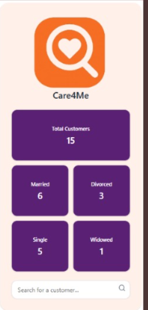
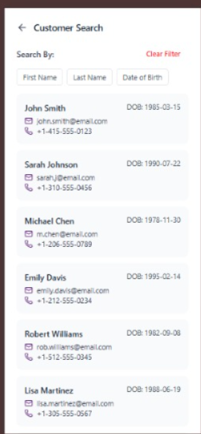

#  Care4Me Web

A **configuration-driven React + TypeScript** web application that dynamically builds and filters customer data using reusable UI logic — built as part of the Care4Me ecosystem.

Home Screen | Search Screen | Filter |  Details Screen |
|----------------|----------------|------------------|------------------|
|  |   |    |  |

---

## 🚀 Tech Stack

| Category | Tools / Libraries |
|-----------|-------------------|
| **Framework** | React 19 + TypeScript |
| **Styling** | TailwindCSS + shadcn |
| **Routing** | React Router DOM v7 |
| **API / HTTP** | Axios |
| **Mock Server** | JSON Server |
| **Date Utilities** | date-fns |
| **Icons** | Lucide-react |

---

## ⚙️ Local Setup

### 1️⃣ Clone & Install
```bash
git clone https://github.com/santlalkaler/care4me_web.git
cd care4me-web
npm install
```

### 2️⃣ Run the Mock API
Start JSON Server (with your existing db.json):
```bash
npx json-server --watch db.json --port 3001
```


### 3️⃣ Start the React App
```bash
npm run dev

```
App will be available at http://localhost:5173/
API runs at http://localhost:3001/

### 🧱 Folder Structure
```bash
src/
 ├─ components/            # Reusable UI components (Header, SearchBar, etc.)
 ├─ config/                # Configuration files (searchConfig.ts)
 ├─ models/                # TypeScript interfaces (Customer, Address, etc.)
 ├─ pages/                 # Page-level components
 ├─ App.tsx
 └─ main.tsx
```

### 🧩 Configuration-Driven Search
The entire search form and filter behavior are powered by the config object searchConfig.ts.
```ts
export const searchConfig: Record<string, FieldConfig> = {
  firstName: {
    key: "firstName",
    type: "text",
    label: "First Name",
    placeholder: "Enter first name",
    renderOrder: 1,
  },
  lastName: {
    key: "lastName",
    type: "text",
    label: "Last Name",
    placeholder: "Enter last name",
    renderOrder: 2,
  },
  dateOfBirth: {
    key: "dateOfBirth",
    type: "date",
    label: "Date of Birth",
    placeholder: "Select date",
    renderOrder: 3,
  },
};

```

### 🔍 Field Model
```ts
export interface FieldConfig {
  key: string;
  label: string;
  type: "text" | "date";
  placeholder?: string;
  renderOrder: number;
}


```

### 🧠 Filtering Logic

The filtering is fully dynamic — it adapts based on the configuration and supports nested fields like addresses.city or phones.number.

```ts
function getFieldValue(obj: any, path: string): any {
  const parts = path.split(".");
  let value = obj;

  for (const part of parts) {
    if (Array.isArray(value)) {
      value = value.map(v => v[part]).filter(v => v !== undefined);
      if (value.length === 1) value = value[0];
    } else if (value && typeof value === "object") {
      value = value[part];
    } else return undefined;
  }
  return value;
}

const handleFilter = (key: string, value: string) => {
  const updated = { ...filters, [key]: value.trim().toLowerCase() };
  setFilters(updated);

  let filtered = customers;

  Object.entries(updated).forEach(([k, v]) => {
    if (!v) return;
    const fieldConfig = searchConfig[k];
    if (!fieldConfig) return;

    filtered = filtered.filter((c) => {
      const rawValue = getFieldValue(c, fieldConfig.key);
      if (!rawValue) return false;

      const values = Array.isArray(rawValue) ? rawValue : [rawValue];
      return values.some((val) => {
        const customerValue = String(val).toLowerCase();
        return fieldConfig.type === "text"
          ? customerValue.includes(v)
          : customerValue === v;
      });
    });
  });

  setFilteredCustomers(filtered);
};

```
✅ Works seamlessly for nested arrays (addresses, phones, etc.)
✅ Fully reusable with just config updates — no code change needed

### 🧾 Sample Schema (db.json)
```json
{
  "customers": [
    {
      "id": "cust-001",
      "firstName": "John",
      "lastName": "Smith",
      "dateOfBirth": "1985-03-15",
      "maritalStatus": "Married",
      "secureId": "12345",
      "addresses": [
        {
          "id": "addr-001",
          "type": "Home",
          "street": "123 Main St",
          "city": "New York",
          "state": "NY",
          "zipCode": "10001"
        }
      ],
      "phones": [
        {
          "id": "ph-001",
          "type": "Mobile",
          "number": "9876543210"
        }
      ],
      "emails": [
        {
          "id": "em-001",
          "isPrimary": true,
          "email": "john@example.com"
        }
      ]
    }
  ]
}

```

### 🕒 Development Time

~2 days total (including setup, API integration, dynamic filter logic, and responsive UI)


### 🧩 Key Highlights

✅ Config-driven architecture — zero code changes for new filters

✅ Handles nested relational data gracefully

✅ Reusable, minimalist components with shadcn + Tailwind

✅ Works seamlessly with existing JSON Server data

✅ Fully type-safe (TypeScript)


